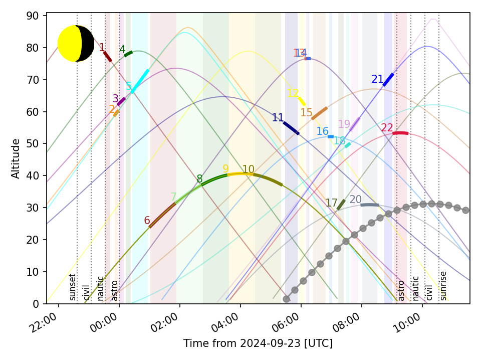
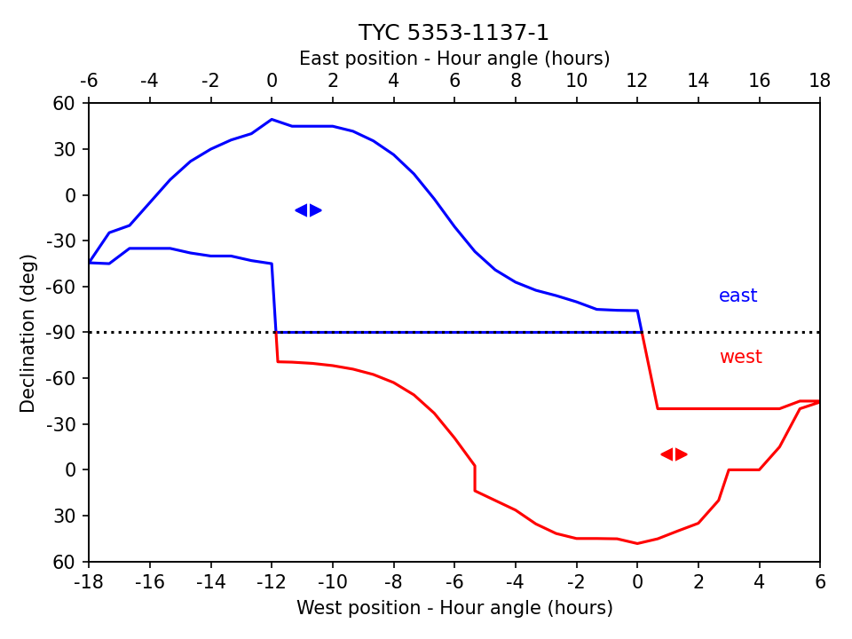
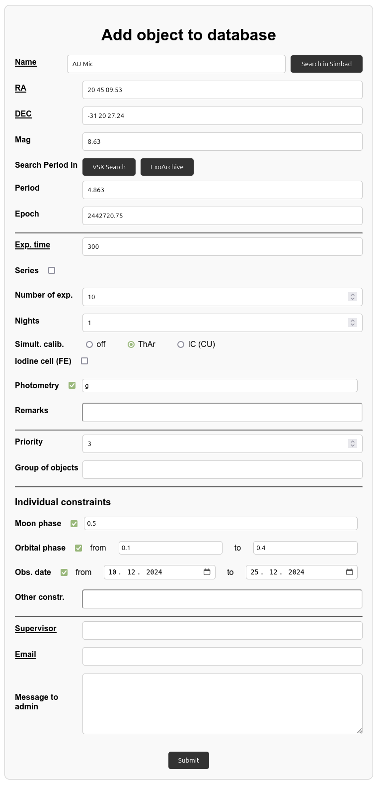
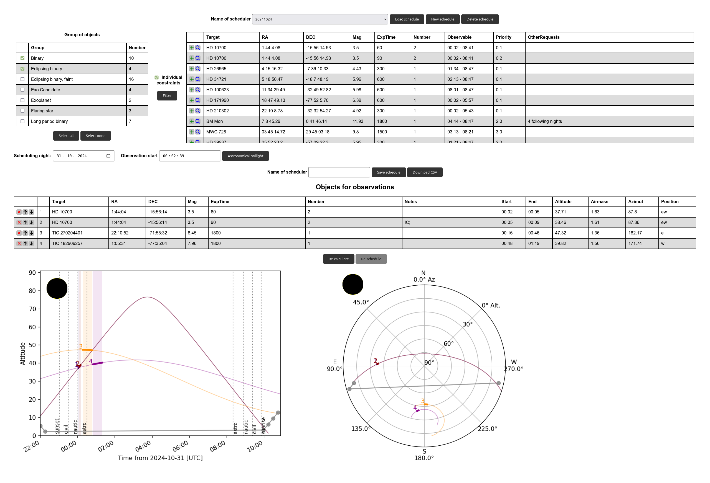

# Scheduler


[](https://app.codacy.com/gh/pavolgaj/Scheduler/dashboard?utm_source=gh&utm_medium=referral&utm_content=&utm_campaign=Badge_grade)

Observation scheduler for PlatoSpec (E152) and OES (Perek telescope)

## Requirements

- python3 - tested on 3.7, 3.8, 3.10 and 3.12
- astroplan - tested on 0.10
- astroquery >= 0.4.7
- pandas - tested on 1.3.5, 1.5.3, 2.0.3 and 2.2.2
- matplotlib - tested on 3.5.3, 3.7.2, 3.7.5 and 3.9.0
- astropy (autoinstallation with astroplan) - tested on 5.2.2, 5.3.4 and 6.1.1
- numpy (autoinstallation with astroplan) - tested on 1.21.6, 1.24.4 and 1.26.4
- flask (web)
- flask-caching, redis (web - cache)
- gunicorn, gevent (WSGI server)

## Instalation

- clone this repository
- (optional) create and activate the virtual environment: e.g. ```python3 -m venv scheduler-venv``` and ```source scheduler-venv/bin/activate```
- install requirements: ```pip install -r requirements.txt```

## File description

- bettersky.py - modification of original astroplan sky.py - plotting star tracks with lines except of points
- scheduler.py - definition of some functions used by the scheduler, import of all packages

 **These files have to be in the same folder as the main scheduler script file (scheduler-test.py or run_scheduler.py)!!!** 

 - scheduler-test.py - example of usage scheduler and testing
 - run_scheduler.py - main script for run scheduler
 - plot_schedule.py - reloading and plotting already generated schedule
 - web.py - server part of web interface
 - send_mail.py - module to send mail after adding an object into the DB 

### Input files

- config file - configuration of observatory site etc. - examples: lasilla-conig.txt, ondrejov-config.txt - structure of file (used format ``` parameter = value```):

  - observatory = _name of observatory_
  - latitude = _obs. latitude in format_ ```??d??m??s``` (only if observatory isn't in [astropy site list](https://github.com/astropy/astropy-data/blob/gh-pages/coordinates/sites.json))
  - longitude = _obs. longitude in format_ ```??d??m??s``` (only if observatory isn't in [astropy site list](https://github.com/astropy/astropy-data/blob/gh-pages/coordinates/sites.json))
  - elevation = _obs. elevation in meters_ (only if the observatory isn't in [astropy site list](https://github.com/astropy/astropy-data/blob/gh-pages/coordinates/sites.json))
  - readout = _read-out time of camera in seconds_ (includes also calibration frames taken after every exposure)
  - slewrate = _slew rate of the telescope in degrees/minute_
  - minAlt = _lower altitude limit in degrees_
  - maxAlt = _upper altitude limit in degrees_
  - maxAirmass = _upper airmass limit_ (lower limit isn't defined = fixed to 1)
  - moonSep = _lower limit of Moon separation in degrees_
  - scheduler = _used schedulers_ (available options: Sequential, Priority, StdPriority - see description below)
  - prefilter = _using objects prefiltering (0 or 1)_ - removing unobservable objects, speeding-up scheduling
  - presort = _using objects presorting (0 or 1)_ - sorting based on culmination time (can improve final schedule in some cases)
  - debug = _generating debug plots (0/1)_ - scores and constratints for individual objects

- object list - list of objects for observations (CSV) - examples: test-objects.csv - the structure of the file (required columns in CSV):

  - Target - name of object
  - RA - RA of the object in hours (possible formats: "hh:mm:ss" or "hh mm ss")
  - DEC - DEC of the object in degrees (possible formats: "dd:mm:ss" or "dd mm ss")
  - ExpTime - individual exposure time in seconds
  - Number - number of exposures (set 1 if blank)
  - Priority - priority (lower number = higher priority). Objects with priority lower than 1 used as standards (see StdPriorityScheduler below). Set default value (3) if blank.
  - _Other columns could be presented in a CSV file but they are not used. They are saved and attached to the final outputs._

- limits_east.txt, limits_west.txt - specification of telescope limits (hour angle, declination), make necessary changes in function ```load_limits```, ```plot_limits``` and ```check_limits``` in scheduler.py
- *.sh - simple scripts to start the web interface or remove old schedules

## Folder description

- db - object DB for web interface
- debug - output for debug plots
- mail - config for sending mail
- schedule - output with generated schedules (tables and plots)
- schedules - storing schedules in the web interface (only necessary CSV file)
- static - folder with static files (images etc.) for the web interface
- templates - folder with HTML templates for web interface

## Available schedulers

- SequentialScheduler (```Sequential``` in config) - scheduling according to the scores of individual blocks, NOT priorities used; a bit slow...
- PriorityScheduler (```Priority``` in config) - scheduling objects with higher priority (lower number) as the first based on their scores
- StdPriorityScheduler (```StdPriority``` in config) - PriorityScheduler which schedules only one target from individual groups with priority lower than 1 (RV standard, SpecPhot standard, etc.)

## Usage

Run ```python3 scheduler-test.py``` or ```python3 run_scheduler.py config_file object_list (date in YYYY-MM-DD) (number of nights)```.

Run ```python3 plot_schedule.py config_file schedule_file.csv date_in_YYYY-MM-DD``` for plotting the already generated schedule (e.g. after some modifications).

## Output files (in the "schedule" folder)

- ?_airmass.png - airmass plot of scheduled objects
- ?_alt.png - altitude plot of scheduled objects
- ?_schedule.txt - table with all scheduled blocks (including telescope moving)
- ?_schedule-objects.txt/csv - table with scheduled object/target blocks
- ?_schedule-queue.txt/csv - table with scheduled object/target blocks with only necessary columns
- ?_full - include also all columns from the input file
- ?_sky.png - star tracks on the sky for scheduled objects
- ?_time.png - time allocations



### Debug plots (in "debug" folder)

- ?_score.png - scores of individual objects as a function of time (objects removed during prefiltering are NOT included) - higher value is better
- ?_score.txt - list of scored targets showing also maximal score for each object, its time, duration and interval of possible observability
- constraints/?_*object_name*.png - observability of individual targets according to all used constraints - green/red color scale (green = observable, red = NOT observable)
- positions/?_*object_name*.png - location of the target inside the telescope limits during the planned observation



## Some remarks...

### Selecting of scheduler

- If you have many targets (more than it's possible to observe) across a large area of the sky, use PriorityScheduler or StdPriorityScheduler (if you defined standards) and turn off presorting. It's faster with reasonable results.
- For small samples of targets (close to the number of possibly observable objects), SequentialScheduler with presorting gives better results. Priority schedulers sometimes make gaps between observing slots...

### Scheduling multiple nights

If scheduling multiple nights, the individual nights are scheduled separately (also with separated presorting and prefiltering). After scheduling one night, already scheduled targets are removed from the objects list and only unscheduled objects are included for scheduling the next night. Targets with priority lower than 1 (some standards) are always included in all scheduling nights - i.e. they aren't removed if they are already scheduled.

## Web interface

- start using flask --app web run --host=0.0.0.0 -p 5000 or python3 -m flask --app web run --host=0.0.0.0 -p 5000 or running web_start.sh (running on port 5000) - for testing phase
- start using waitress-serve --host 0.0.0.0 --port=5000 web:app or python3 -m waitress-serve --host 0.0.0.0 --port=5000 web:app or running web.sh (running on port 5000) - for production phase
- running on localhost:5000/scheduler

**The short user guide is written on the title page of the web interface (see [web.pdf](web.pdf)).**

### Object database 

- adding objects to DB (individually or bulk import)
- managing DB by admin
- show objects in DB



### Scheduler

- running the automatic scheduler - selection of objects based on groups
- applying also individual constraints
- saving created schedule
- manual modification - add, remove and re-order targets



### Logs & statistics

- display logs generated using [NightLog](https://github.com/pavolgaj/NightLog)
- basic statistics about observed objects


